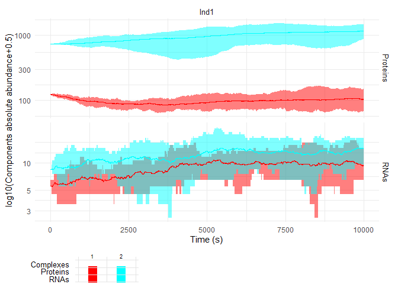
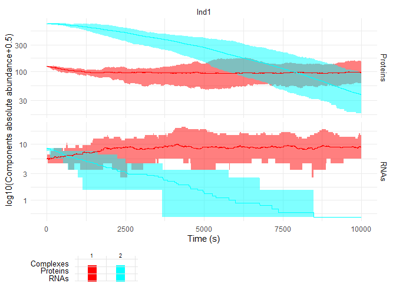
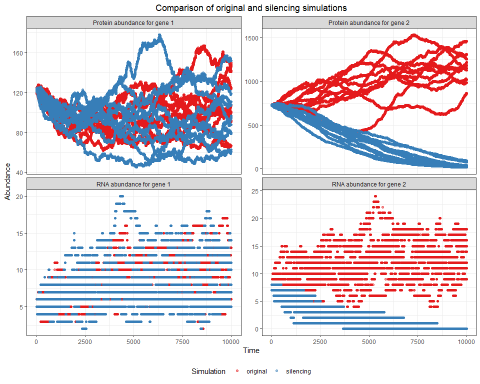

Testing sismonr
================
Olivia Angelin-Bonnet
July 17, 2023

- [2-genes activating system](#2-genes-activating-system)
  - [Creating the system and
    individuals](#creating-the-system-and-individuals)
  - [Running a simulation](#running-a-simulation)
- [Silencing target gene](#silencing-target-gene)
- [Comparing original and silencing
  simulations](#comparing-original-and-silencing-simulations)

``` r
theme_set(theme_bw())
theme_update(plot.title = element_text(hjust = 0.5))
theme_update(legend.position = "bottom")
```

## 2-genes activating system

We’ll start by simulating a simple system with 2 genes: a transcription
regulator, and its target; the regulator activates the transcription of
the target. For the simulation, we’ll generate one individual which has
no mutations on the genes. We’ll run 10 simulations for this individual,
with a simulation time of 10,000 seconds (to make sure that we observe
the effect of the regulation).

### Creating the system and individuals

``` r
set.seed(364)

## Creating system with one regulator gene
my_system <- createInSilicoSystem(
  empty = TRUE, 
  G = 1,
  PC.p = 1,
  PC.TC.p = 1,
  TC.pos.p = 1,
  ploidy = 2
) |> 
  ## Adding the target gene
  addGene(
    coding = "PC",
    TargetReaction = "MR"
  ) |> 
  ## Adding the regulation of gene 2 by gene 1
  addEdge(
    regID = 1,
    tarID = 2,
    regsign = "1"
  )
```

``` r
my_system$genes
```

    ##   id coding TargetReaction PTMform ActiveForm      TCrate      TLrate
    ## 1  1     PC             TC       0         P1 0.001856760 0.005306477
    ## 2  2     PC             MR       0         P2 0.001768379 0.041485279
    ##         RDrate       PDrate
    ## 1 0.0004297509 0.0004607908
    ## 2 0.0004466994 0.0004469689

``` r
my_system$edg
```

    ##   from to TargetReaction RegSign RegBy
    ## 1    1  2             TC       1    PC

``` r
my_pop <- createInSilicoPopulation(
  1,
  my_system,
  ngenevariants = 1
)
```

### Running a simulation

``` r
set.seed(948)
sim_null <- simulateInSilicoSystem(
  my_system,
  my_pop,
  simtime = 10000,
  ntrials = 10
)
```

    ## Generating the stochastic system...

    ## Done.

    ## 

    ## Starting simulations at 2023-07-17 12:13:05 NZST

    ##   |                                                                              |                                                                      |   0%  |                                                                              |======================================================================| 100%

    ## 
    ## Simulations finished at 2023-07-17 12:13:43 NZST

    ## Mean running time per simulation: 38.13 seconds.

``` r
plotSimulation(sim_null$Simulation)
```

<!-- -->

``` r
df_null <- sim_null$Simulation |> 
  mergeAlleleAbundance() |> 
  as_tibble() |> 
  mutate(data_type = "original")
```

## Silencing target gene

Now we’ll modify the system by silencing the transcription of the target
gene. We do this by setting its transcripton rate to a very small value.
We didn’t modify any property of the regulator or of the regulation.

``` r
my_system_silencing <- my_system
my_pop_silencing <- my_pop

my_system_silencing$genes[2, "TCrate"] <-  1e-20
```

``` r
my_system_silencing$genes
```

    ##   id coding TargetReaction PTMform ActiveForm      TCrate      TLrate
    ## 1  1     PC             TC       0         P1 1.85676e-03 0.005306477
    ## 2  2     PC             MR       0         P2 1.00000e-20 0.041485279
    ##         RDrate       PDrate
    ## 1 0.0004297509 0.0004607908
    ## 2 0.0004466994 0.0004469689

``` r
my_system_silencing$edg
```

    ##   from to TargetReaction RegSign RegBy
    ## 1    1  2             TC       1    PC

``` r
set.seed(948)
sim_silencing <- simulateInSilicoSystem(
  my_system_silencing,
  my_pop_silencing,
  simtime = 10000,
  ntrials = 10
)
```

    ## Generating the stochastic system...

    ## Done.

    ## 

    ## Starting simulations at 2023-07-17 12:13:47 NZST

    ##   |                                                                              |                                                                      |   0%  |                                                                              |======================================================================| 100%

    ## 
    ## Simulations finished at 2023-07-17 12:14:20 NZST

    ## Mean running time per simulation: 33.03 seconds.

``` r
plotSimulation(sim_silencing$Simulation)
```

<!-- -->

``` r
df_silencing <- sim_silencing$Simulation |> 
  mergeAlleleAbundance() |> 
  as_tibble() |> 
  mutate(data_type = "silencing")
```

## Comparing original and silencing simulations

The plot below compares the RNA and protein abundance of each gene
between the two simulations. As expected, only the expression of the
target gene is impacted by the silencing.

``` r
bind_rows(
  df_null,
  df_silencing
) |> 
  pivot_longer(
    cols = matches("(P|R)\\d"),
    names_to = "molecule",
    values_to = "abundance"
  ) |> 
  mutate(
    molecule = str_replace(molecule, "^P", "Protein abundance for gene "),
    molecule = str_replace(molecule, "^R", "RNA abundance for gene ")
  ) |> 
  ggplot(aes(x = time, y = abundance, colour = data_type)) +
  geom_point(alpha = 0.5) +
  facet_wrap(~ molecule, scale = "free_y") +
  scale_colour_brewer(palette = "Set1") +
  labs(
    title = "Comparison of original and silencing simulations",
    x = "Time",
    y = "Abundance",
    colour = "Simulation "
  )
```

<!-- -->
